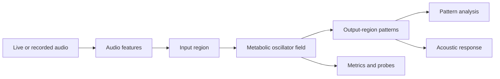

# Neuroacoustic Resonator

[Русская версия](README.ru.md)

[](https://github.com/ZapolyarnyDev/neuroacoustic-resonator/actions/workflows/ci.yml)
[](https://www.python.org/)
[](LICENSE)

> 🗣️👂 A self-organizing neuroacoustic system that transforms live sound into
> evolving oscillator-field dynamics and generates responses from emergent
> synchronization.

Neuroacoustic Resonator is an experimental dynamical system built from coupled
phase oscillators, local energy metabolism, adaptive connections, memory traces,
and audio-driven perturbations.

It is not a language model. It starts without a vocabulary, pretrained weights,
or symbolic rules. The project asks a narrower, testable question: can stable,
repeatable acoustic patterns emerge from continuous field dynamics, and can
those patterns remain sensitive to the sounds that produced them?

The project is in an early research stage. Current results are experimental and
should not be interpreted as evidence of language, cognition, or consciousness.

## How it works



The field is divided into input, association, and output regions. Audio features
perturb the input region; activity then propagates through local coupling,
plasticity, metabolic constraints, and memory traces. The output region is
measured for synchronization, phase structure, energy state, and recurring
patterns. These measurements can drive an acoustic response or be exported for
offline analysis.

## What has already been done

- A two-dimensional field of coupled phase oscillators.
- Local metabolite consumption, recovery, and diffusion.
- Frequency and coupling plasticity with homeostatic bounds.
- Audio feature extraction and configurable input routing.
- Output-region pattern signatures and temporal pattern history.
- Pattern calibration, propagation, voice-response, and memory probes.
- Checkpoint save/resume support for longer experiments.
- Offline metrics, diagnostics, plots, summaries, and benchmark exports.
- Turn-based microphone interaction and WAV-based conversation experiments.
- Reproducible configuration through YAML, `uv`, and a locked dependency graph.

## Where the project is heading

The current goal is to teach the field to describe its own behavior in a way
that makes sense. I call this mechanism the sound protocol: a shared description
of the field's state and the patterns it detects. Different sound modes will use
this protocol to interpret the same field.

Once the protocol can reliably distinguish responses to different inputs, sound
generation can be split into a separate layer. A biomorphic voice, modular
synth, voice-like but nonverbal mode, percussion, or dark ambient mode will all
be able to work with the same field without rebuilding the engine.

> A self-hosted web app is in the plans 😈

One idea I find interesting: a field with its own continuous dynamics might one
day (or maybe not 😉) become an external state layer for a frozen model (an LLM,
of course), giving it ongoing processes that continue beyond its training.
cutoff.

## Quick start

Requirements:

- Python 3.13
- [`uv`](https://docs.astral.sh/uv/)

Install the locked development dependencies:

```bash
uv sync --locked --dev
```

Run a short simulation and create an image of the field:

```bash
uv run python main.py
```

The result will be saved to `outputs/field-preview.png`.

If [`just`](https://just.systems/) is installed, see the available recipes with:

```bash
just
```

## Live audio experiment

Available audio devices:

```bash
just audio-devices
```

Start turn-based interaction through the microphone:

```bash
just live-conversation
```

This is an experimental test bench for the current field and its
response-generation pipeline, not the final result.

## Research workflows

Run calibration on synthetic signals:

```bash
just pattern-calibration
```

Check how a perturbation propagates:

```bash
just propagation-probe
```

Collect a long sequence of metrics:

```bash
just metrics
```

Run a set of experiments:

```bash
just experiments
```

Generated files are saved to `experiments/` and `outputs/`. The README files
inside them describe the expected contents of these directories.

## Repository layout

```text
configs/      Reproducible simulation configurations
scripts/      Entry points for research, audio, benchmarks, and state persistence
src/          Field engine, analysis, audio, I/O, and visualizations
tests/        Unit and integration tests
experiments/  Generated research artifacts
outputs/      Generated images, metrics, and benchmarks
```

## Development

Run all local checks:

```bash
just check
```

Fix lint errors and format the code:

```bash
just fmt
```

Install and run pre-commit hooks:

```bash
just hooks-install
just hooks
```

I use Ruff, mypy, pytest, pre-commit, and CI on Linux and Windows here.
P.S. The current contribution policy is described in
[CONTRIBUTING.md](CONTRIBUTING.md).

## License

[MIT](LICENSE)
