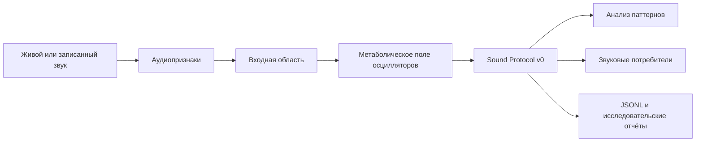

# Neuroacoustic Resonator

[English version](README.md)

[](https://github.com/ZapolyarnyDev/neuroacoustic-resonator/actions/workflows/ci.yml)
[](https://www.python.org/)
[](LICENSE)

> 🗣️👂 Самоорганизующаяся нейроакустическая система, которая преобразует живой
> звук в эволюционирующую динамику поля осцилляторов и генерирует отклик на
> основе возникающей синхронизации.

Neuroacoustic Resonator — экспериментальная динамическая система из связанных
фазовых осцилляторов, локального энергетического метаболизма, адаптивных связей,
следов памяти и возмущений, создаваемых звуковым входом.

Это не языковая модель. У системы нет исходного словаря, предобученных весов или
символических правил. Проект ставит более узкий и проверяемый вопрос: могут ли
из непрерывной динамики поля возникать устойчивые и повторяемые акустические
паттерны и останутся ли они чувствительными к вызвавшему их звуку?

Проект находится на ранней исследовательской стадии. Текущие результаты
экспериментальны и не являются доказательством языка, мышления или сознания.

## Как это работает



Поле разделено на входную, ассоциативную и выходную области. Аудиопризнаки
возмущают входную область, после чего активность распространяется через
локальные связи, пластичность, метаболические ограничения и следы памяти.
В выходной области измеряются синхронизация, фазовая структура, энергетическое
состояние и повторяющиеся паттерны. Эти измерения могут управлять звуковым
откликом или сохраняться для последующего анализа.

## Что уже сделано

- Двумерное поле связанных фазовых осцилляторов.
- Локальное потребление, восстановление и диффузия метаболита.
- Пластичность частот и связей с гомеостатическими ограничениями.
- Извлечение аудиопризнаков и настраиваемая маршрутизация входа.
- Сигнатуры паттернов выходной области и история их изменения во времени.
- Строгий версионированный звуковой протокол JSONL с точным offline replay.
- Калибровка паттернов, пробы распространения, отклика на голос и памяти.
- Сохранение и продолжение долгих экспериментов из контрольных точек.
- Экспорт метрик, диагностик, графиков, сводок и бенчмарков.
- Пошаговое взаимодействие через микрофон и эксперименты с WAV-файлами.
- Воспроизводимые YAML-конфигурации и зафиксированный через `uv` граф
  зависимостей.

## Куда движется проект

Текущая цель - научить поле внятно описывать собственное поведение. Данный механизм
я решил назвать звуковым протоколом (через который будут работать различные звуковые режимы).

Когда протокол начнёт уверенно различать отклики на разные входы, генерацию
звука можно будет отдельно вынести. Биоморфный голос, modular synth,
голосоподобный, но неречевой режим, перкуссия или тёмный ambient будут работать с одним полем без переделки движка.

> Self-hosted веб-приложение в планах 😈

Моя интересная мысль: поле с собственной непрерывной
динамикой когда-нибудь (или нет😉) может стать внешним слоем состояния для замороженной
модели (речь о LLM, конечно же) и дать ей процессы, которые не заканчиваются датой обучения.

## Быстрый старт

Требования:

- Python 3.13
- [`uv`](https://docs.astral.sh/uv/)

Установить зафиксированное окружение разработки:

```bash
uv sync --locked --dev
```

Запустить короткую симуляцию и создать изображение поля:

```bash
uv run python main.py
```

Результат будет сохранён в `outputs/field-preview.png`.

Если установлен [`just`](https://just.systems/), доступные рецепты просмотрите так:

```bash
just
```

## Запись и воспроизведение поля

Sound Protocol v0 теперь является общим потоком для разговоров, диагностики и
исследовательских сценариев. Записать воспроизводимую симуляцию в строгий JSONL:

```bash
just protocol-record
```

Воспроизвести запись без запуска поля осцилляторов:

```bash
just protocol-replay
```

При replay можно получить сводку и WAV через текущий диагностический reference
renderer. Это ещё не один из запланированных звуковых режимов.

Напрямую CLI использует те же команды:

```bash
uv run neuroacoustic-protocol record --config configs/field_only.yaml --steps 128 --output outputs/protocol/recording.jsonl
uv run neuroacoustic-protocol replay --input outputs/protocol/recording.jsonl
```

Минимальный пример точного round-trip находится в
[examples/protocol_round_trip.py](examples/protocol_round_trip.py).

## Эксперимент с живым звуком

Доступные аудиоустройства:

```bash
just audio-devices
```

Запустить пошаговое взаимодействие через микрофон:

```bash
just live-conversation
```

Это экспериментальный стенд для проверки текущего поля и цепочки генерации
отклика, а не финальный результат.

## Исследовательские сценарии

Запустить калибровку на синтетических сигналах:

```bash
just pattern-calibration
```

Проверить распространение возмущения:

```bash
just propagation-probe
```

Собрать длинную последовательность метрик:

```bash
just metrics
```

Запустить набор экспериментов:

```bash
just experiments
```

Созданные файлы сохраняются в `experiments/` и `outputs/`. Вложенные README
описывают ожидаемое содержимое этих каталогов.

## Структура репозитория

```text
configs/      Воспроизводимые конфигурации симуляции
scripts/      Точки входа для исследований, аудио, бенчмарков и состояния
src/          Движок поля, анализ, аудио, ввод-вывод и статические изображения
tests/        Модульные и интеграционные тесты
examples/     Небольшие воспроизводимые примеры протокола
experiments/  Создаваемые исследовательские артефакты
outputs/      Создаваемые изображения, метрики и бенчмарки
```

## Разработка

Запустить все локальные проверки:

```bash
just check
```

Исправить lint-ошибки и отформатировать код:

```bash
just fmt
```

Установить и запустить pre-commit hooks:

```bash
just hooks-install
just hooks
```

Здесь юзаю Ruff, mypy, pytest, pre-commit и CI на Linux и Windows.
P.S. Текущая политика участия описана в [CONTRIBUTING.md](CONTRIBUTING.md).

## Лицензия

[MIT](LICENSE)
